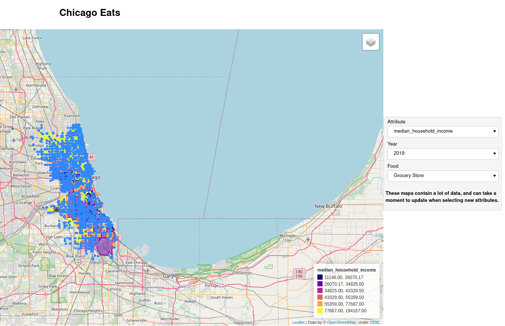

# Chicago Eats

### Overview

The goal of this project is to visualize the relationship between demographic information, and the different kinds of food sources in Chicago.
With tract level American Community Survey Data from the Census, and food inspection data from the City of Chicago, we created a dashboard that allows us to visualize these layers of data simultaneously. We also did some additional levels of analysis.

### Instructions

1. Navigate into the `chicagoeats` folder from the command line
2. Create the virtual environment: `source install.sh`
3. Enter the virtual environment: `source env/bin/activate`
4. Interact with the command line:
   1. To re-run the process of fetching/cleaning the data(found in the 'data' directory) for the project
      enter the following command: `python app.py --data`
   2. To launch interactive visualizations enter the the following command: `python app.py --viz`. This should print out a ocalhost address. Navigate to the address in your browser.

### To access supplemental visuals
1. Run `python app.py --notebooks`. This will open Jupyter Notebooks in your browser.
2. Navigate from `chicagoeats` → `analytics` module.
3. Open `PPA.ipynb` and `zipcodeviz.ipynb` to explore.
